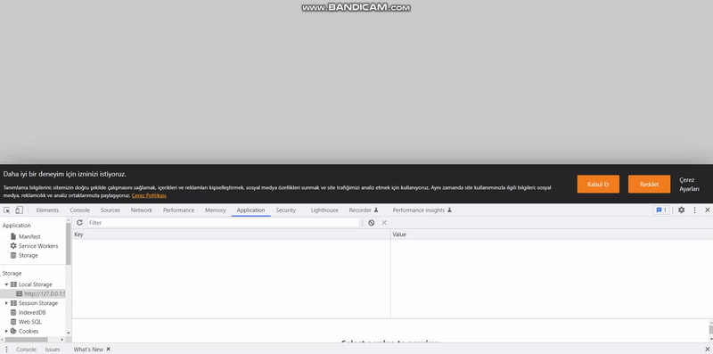
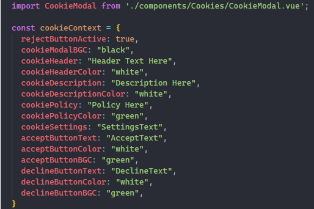
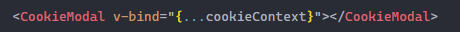
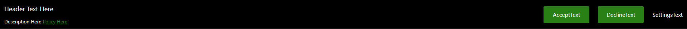

# Cookie Modal Project

This is a cookie modal project and it is customizable. Accept or Decline is saved into local storage. You can see the full list of configurations below.

## First install all dependencies

- npm install

## Instructions
- Props

- Sending component and prop

- Fully customazible cookie modal

## Customizable Options

| Props                  | Type    | Description                                            | Default Value               |
|------------------------|---------|--------------------------------------------------------|-----------------------------|
| rejectButtonActive     | boolean | You can customize the reject button active or not.     | true                        |
| cookieModalBGC         | string  | You can customize the background color of the modal.   | "rgb(38,38,38)"             |
| cookieHeader           | string  | You can customize the Header text.                     | "Daha iyi bir...."          |
| cookieHeaderColor      | string  | You can customize the Header text color.               | "white"                     |
| cookieDescription      | string  | You can customize the description text.                | "Tanımlama bilgilerini...." |
| cookieDescriptionColor | string  | You can customize the description text color.          | "white"                     |
| cookiePolicy           | string  | You can customize the cookie policy text.              | "Çerez Politikası"          |
| cookiePolicyColor      | string  | You can customize the cookie policy text color.        | "orange"                    |
| cookieSettings         | string  | You can customize the cookie settings text.            | "Çerez Ayarları"            |
| acceptButtonText       | string  | You can customize the accept button text.              | "Kabul Et"                  |
| acceptButtonColor      | string  | You can customize the accept button text color.        | "white"                     |
| acceptButtonBGC        | string  | You can customize the accept button background color.  | "rgb(255,128,0)"            |
| declineButtonText      | string  | You can customize the decline button text.             | "Reddet"                    |
| declineButtonColor     | string  | You can customize the decline button text color.       | "white"                     |
| declineButtonBGC       | string  | You can customize the decline button background color. | "rgb(255,128,0)"            |

